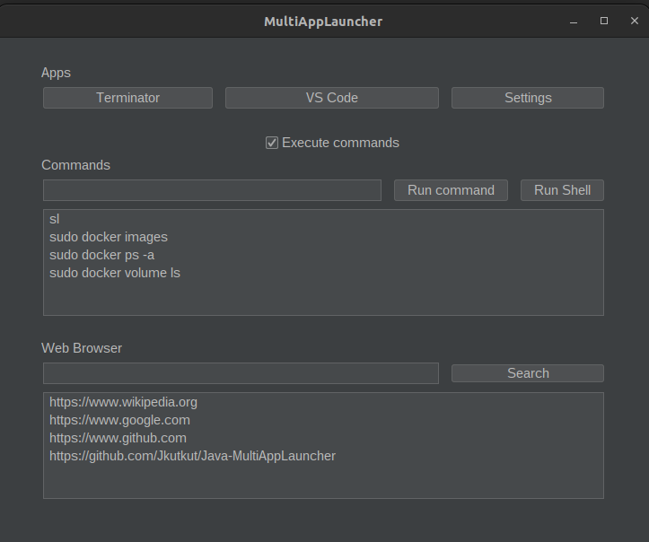

Simple application to start processes in Java using Java Swing.

## Features:
- Responsive: The screen can be resized to fit any screen.
- Custom menu to execute cmds.
	- Keeping the console alive after the cmd.
	- Killing the console after the cmd.
- Custom error detection system: Custom exception handling system to detect and handle errors.
- Website validation: The website is validated by regex and the server is pinned before opening the tab.
- When entering the URL, if the enter key is pressed, the tab will open.
- Default values in DB: if DB files are missing, default values are added.
- Delete key in lists deletes the element (also saves the state on the DB).
- DarkMode: The only serious theme.
- Logo: Custom logo made by Dall-E
